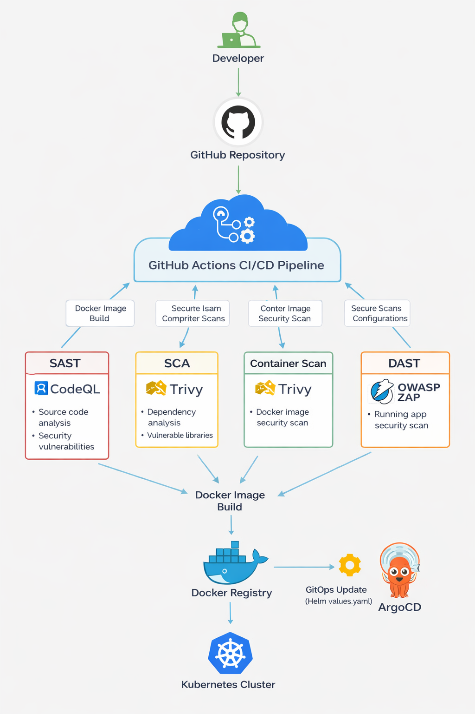

# DevSecOps CI/CD Pipeline – Node.js Application

Este repositorio contiene una implementación de un pipeline **DevSecOps completo** para una aplicación Node.js.  
El pipeline automatiza el proceso de **build, pruebas, análisis de seguridad, construcción de contenedores y despliegue GitOps en Kubernetes**.

La solución implementa principios de **Shift Left Security**, integrando controles de seguridad durante todo el ciclo de vida del desarrollo.

---

# Arquitectura
El flujo de la arquitectura es el siguiente:

---

# Estructura del proyecto

├── .github/workflows'\
│ └── triggerci.yml\
├── argocd\
│ └── application.yaml\
├── helm\
│ ├── Chart.yaml\
│ ├── values.yaml\
│ └── templates\
│ └── deployment.yaml\
├── src\
│ ├── app.js\
│ └── index.js\
├── test\
│ └── app.test.js\
├── Dockerfile\
├── package.json\
└── README.md\

---

# Pipeline DevSecOps

El pipeline se ejecuta automáticamente cuando se realiza un **push a la rama main**.

Se compone de los siguientes stages:

## 1. Security Tests Stage

Este stage ejecuta controles de seguridad y calidad del código.

### Unit Testing

Se ejecutan pruebas unitarias usando **Jest**.

El pipeline valida que el **coverage sea mayor al 80%**.

---

### SAST (Static Application Security Testing)

Se utiliza **CodeQL** para detectar vulnerabilidades en el código fuente.

Herramienta utilizada:

GitHub CodeQL

Analiza:

- vulnerabilidades
- malas prácticas
- errores de seguridad

---

### SCA (Software Composition Analysis)

Se analiza la seguridad de las dependencias usando **Trivy**.

Esto permite detectar:

- CVEs en librerías
- dependencias vulnerables
- problemas de seguridad conocidos

---

# 2. Build Stage

En esta etapa se construye la imagen de contenedor.

Se utiliza **Docker** para crear la imagen de la aplicación.

La imagen se etiqueta con el **commit SHA** para garantizar trazabilidad.

Posteriormente se publica en el registry Docker.

---

### Container Security Scan

Antes del despliegue se realiza un escaneo de la imagen Docker utilizando **Trivy**.

Esto permite detectar:

- vulnerabilidades en el sistema base
- CVEs en paquetes del contenedor

---

# 3. DAST Stage

Se realiza un análisis dinámico de seguridad utilizando **OWASP ZAP**.

La aplicación se levanta temporalmente dentro del pipeline y se ejecuta un escaneo sobre: "http://localhost:3000"

Este escaneo permite detectar:

- vulnerabilidades web
- headers inseguros
- configuraciones incorrectas
- endpoints vulnerables

---

# 4. GitOps Deployment

El despliegue sigue el modelo **GitOps**.

El pipeline actualiza automáticamente el archivo: "helm/values.yaml"

Reemplazando el tag de la imagen por el SHA del commit: "tag: -commit-sha-"

Este cambio se envía al repositorio y es detectado por **ArgoCD**, que sincroniza el estado con el clúster de Kubernetes.

---

# Kubernetes Deployment

El despliegue se realiza usando **Helm Charts**.

Helm permite:

- versionar configuraciones
- gestionar templates Kubernetes
- parametrizar despliegues

Archivo principal: "helm/templates/deployment.yaml"

---

# ArgoCD

Se utiliza **ArgoCD** para implementar GitOps.

El manifiesto de aplicación se encuentra en: "argocd/application.yaml"

ArgoCD monitorea el repositorio y aplica automáticamente los cambios en el clúster.

---

# Beneficios de la solución

Este pipeline implementa buenas prácticas DevSecOps:

- Integración continua automatizada
- Seguridad integrada desde el desarrollo
- Escaneo de dependencias
- Escaneo de contenedores
- Análisis dinámico de seguridad
- Despliegue automatizado GitOps
- Versionado de imágenes con commit SHA

---

# Tecnologías utilizadas

- Node.js
- Docker
- GitHub Actions
- Helm
- Kubernetes
- ArgoCD
- CodeQL
- Trivy
- OWASP ZAP

---

# Autor

Juan Acosta
DevSecOps Technical Challenge

